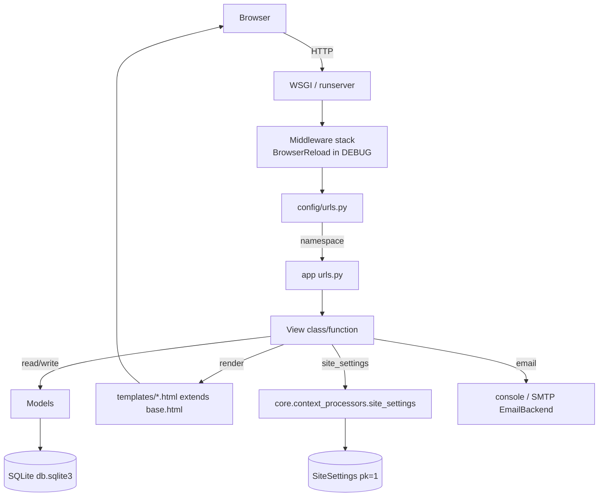
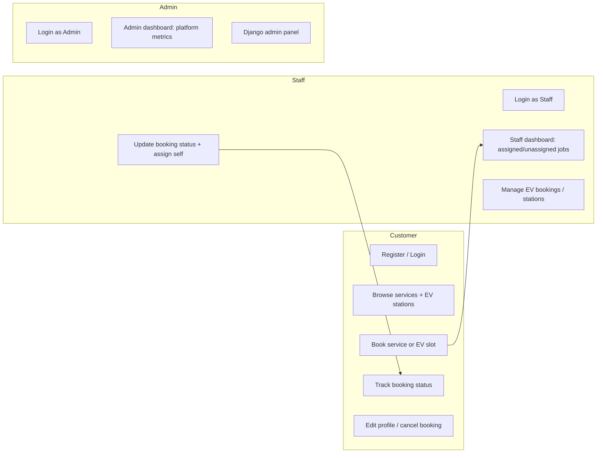
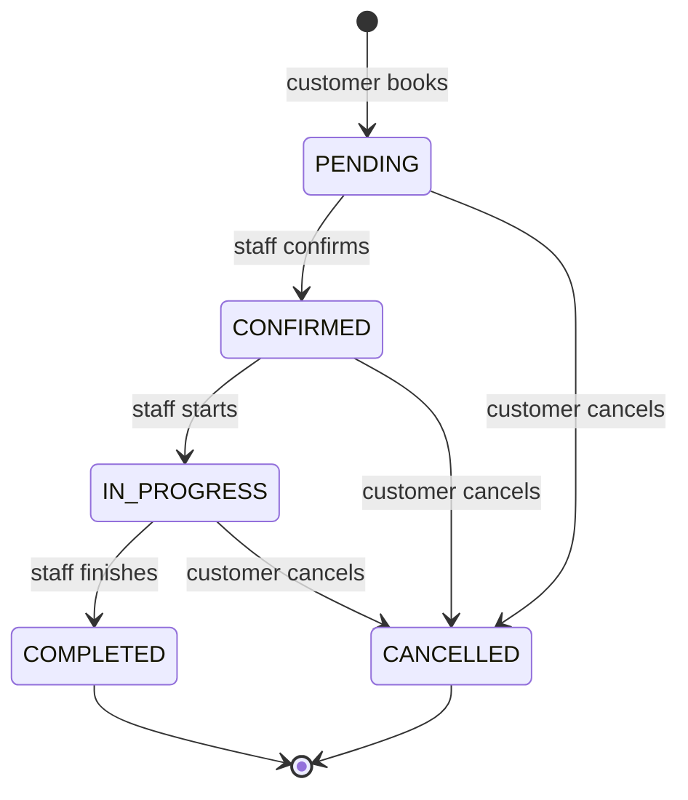

# ServiGo — Project Workflow

> **Source of truth:** This document is derived strictly from the ServiGo source
> code (`D:\AbiLabs\ServiGo`). Paths, class names, function names, URL names, and
> model fields below all map to actual code. Where a feature described in the
> product docs is **not** implemented in code, it is called out explicitly.

ServiGo is a Django 5.2 home-services + EV-charging booking platform. Customers
browse services and EV charging stations, book them, and track status through a
role-aware dashboard (Customer / Staff / Admin).

---

## 1. Purpose and Main Features

**Purpose:** A two-sided booking platform connecting customers with service
professionals (electrical, plumbing, smart-TV) and EV charging stations.

**Main features (all implemented in code):**

| Feature | Where it lives | Notes |
| --- | --- | --- |
| Customer self-registration | `accounts/forms.py::UserRegistrationForm` | Role limited to Customer/Staff (admin excluded) |
| Email-or-username login | `accounts/backends.py::EmailOrUsernameBackend` | Case-insensitive lookup, timing-uniform check |
| Service catalogue (browse/search/filter) | `services/views.py` | Three seeded categories |
| Service booking + status workflow | `bookings/` | State machine + audit history |
| EV station discovery + booking | `ev_charging/` | Charger-type filter, availability, pricing |
| Role dashboards | `dashboard/views.py` | Customer / Staff / Admin views |
| Contact form + admin auto-reply | `core/views.py::ContactView` | Writes `ContactMessage` |
| Site settings singleton | `core/models.py::SiteSettings` | Globally exposed via context processor |
| Staff profile management | `accounts/views.py::staff_profile_update` | `StaffProfile` with hourly rate, radius, rating |
| Customer profile management | `accounts/views.py::customer_profile_update` | `CustomerProfile` with loyalty points |

**Explicitly NOT implemented** (documented in `PRODUCT.md` roadmap, absent in code):
online payments, reviews/ratings from customers, real-time SMS/email, availability
scheduling, a REST API, and an **interactive** Google Maps widget (only a static
"Get directions" link exists — see §10).

---

## 2. Project Structure and Important Files

```
ServiGo/
├── config/
│   ├── settings.py          # Django config: apps, auth backend, sessions, security
│   ├── urls.py              # Root URL routing + error handlers
│   ├── wsgi.py / asgi.py
│   └── __init__.py
├── accounts/                # Auth, custom User, profiles, login backend
├── services/                # ServiceCategory, Service catalogue
│   └── templatetags/service_images.py   # category_image filter
├── bookings/                # Service Booking + status machine + history
├── ev_charging/             # EVChargingStation, EVChargingBooking
├── dashboard/               # Customer/Staff/Admin dashboards (no models)
├── core/                    # Home, About, Contact, SiteSettings, errors
│   └── management/commands/seed_demo.py
├── templates/               # All HTML (extends templates/base.html)
├── static/                  # CSS, JS, images (images/<category-slug>.jpg)
├── tests/accounts/          # The only test package (67 tests)
├── requirements.txt
├── .env.example             # Variable NAMES only (no secret values)
├── README.md / PRODUCT.md
└── manage.py
```

**Important files:** `config/settings.py` (single config authority),
`accounts/models.py` (custom `User`), `accounts/backends.py` (auth),
`core/models.py::SiteSettings` (singleton), `seed_demo.py` (demo data).

---

## 3. Architecture and Complete Data Flow

ServiGo is a standard Django request/response monolith — no async, no external
API backend, no message queue.



**Key architectural points:**

- **Single settings module** (`config/settings.py`) drives everything: `INSTALLED_APPS`,
  `AUTHENTICATION_BACKENDS`, `AUTH_USER_MODEL`, session policy, and the
  `if not DEBUG:` production security block.
- **Root routing** (`config/urls.py`) maps URL prefixes to app `urls.py` with
  namespaces: `""`→core, `accounts/`, `services/`, `bookings/`, `ev/`, `dashboard/`.
- **Global context:** `core.context_processors.site_settings` injects the
  singleton `SiteSettings` into every template (`{{ site_settings }}`).
- **Persistence:** SQLite (`BASE_DIR/db.sqlite3`). `DATABASE_URL` env can switch
  to Postgres in prod (per `.env.example`), but code ships SQLite.
- **Caching:** `LocMemCache` (default, no Redis dependency).
- **Sessions:** `SESSION_EXPIRE_AT_BROWSER_CLOSE=True`, `SESSION_COOKIE_AGE=1800`,
  `SESSION_SAVE_EVERY_REQUEST=True`.
- **Dev live-reload:** `django_browser_reload` middleware + `__reload__` route
  (DEBUG only).

---

## 4. Customer / Service-Provider Workflows



- **Customer:** registers (`UserRegistrationForm`, role forced to CUSTOMER via
  `PUBLIC_ROLE_CHOICES`), browses, books, sees bookings in
  `dashboard:customer`. Booking creation sends a confirmation email.
- **Service provider (Staff):** `StaffRequiredMixin` gates staff views. Staff
  see only their assigned + unassigned bookings (`StaffBookingListView`,
  `StaffEVBookingListView`), update status via `BookingStatusUpdateForm` which
  writes a `BookingStatusHistory` row. `StaffProfile` carries hourly_rate,
  specialization, working_radius_km, rating.
- **Admin:** `AdminRequiredMixin` gates `dashboard:admin` (platform-wide counts,
  revenue, popular services). Also reaches Django's `admin/` site
  (`is_staff=True`, `is_superuser=True`).

---

## 5. Booking Workflow

### 5.1 Service booking (`bookings/`)



- **Create:** `BookingCreateView` (`bookings/views.py`) — `LoginRequiredMixin`;
  `dispatch` fetches the `Service` (must be `is_available`); `form_valid` writes
  customer snapshot + service name/price, sends confirmation email, redirects to
  `bookings:confirmation`.
- **Cancel:** `booking_cancel` — `@login_required`; blocks COMPLETED/CANCELLED;
  on POST sets CANCELLED and appends a `BookingStatusHistory` ("Cancelled by customer").
- **Status update (staff):** `StaffBookingDetailView.post` uses
  `BookingStatusUpdateForm` and appends `BookingStatusHistory` with `changed_by`.
- **Audit trail:** every status change appends `BookingStatusHistory`
  (`previous_status`, `new_status`, `changed_by`, `notes`).

### 5.2 EV booking (`ev_charging/`)

Same shape with `PENDING → CONFIRMED → ACTIVE → COMPLETED/CANCELLED`.
`EVBookingCreateView.form_valid` computes `estimated_cost = estimated_kwh * station.price_per_kwh`
in `EVBookingForm.save()`. `ev_booking_cancel` blocks COMPLETED/CANCELLED.

---

## 6. Backend URLs, Views, Models and Important Functions

### 6.1 URL namespaces & prefixes (from `config/urls.py`)

| Prefix | App | `app_name` |
| --- | --- | --- |
| `""` | core | `core` |
| `accounts/` | accounts | `accounts` |
| `services/` | services | `services` |
| `bookings/` | bookings | `bookings` |
| `ev/` | ev_charging | `ev_charging` |
| `dashboard/` | dashboard | `dashboard` |
| `admin/` | Django admin | — |

Error handlers (`handler404/403/500`) → `core.views`.

### 6.2 `accounts`

URLs (`accounts/urls.py`): `register/`, `login/`, `logout/`, `profile/`,
`profile/edit/`, `profile/staff/`, `profile/customer/`, `password/change/`,
`password/change/done/`.

Views (`accounts/views.py`):
- `RegisterView(CreateView)` → `accounts/register.html`
- `login_view(request)` — handles `next` safely (§9); role-based redirect
- `logout_view` (`@login_required`)
- `ProfileView(LoginRequiredMixin, DetailView)`
- `ProfileUpdateView(LoginRequiredMixin, UpdateView)`
- `staff_profile_update`, `customer_profile_update` (`@login_required`, role-blocked)

Backend (`accounts/backends.py`): `EmailOrUsernameBackend.authenticate` —
`Q(email__iexact=username) | Q(username__iexact=username)`; on `DoesNotExist`
runs `User().set_password(password)` (timing uniformity); on
`MultipleObjectsReturned` returns `None`.

### 6.3 `core`

URLs (`core/urls.py`): `""`→home, `about/`, `contact/`.

Views (`core/views.py`): `HomeView` (featured services, categories, ev count,
site settings), `AboutView`, `ContactView(FormView)` (saves `ContactMessage`,
sends admin notification + user auto-reply via `send_mail(fail_silently=True)`),
`handler404/403/500`.

Context (`core/context_processors.py`): `site_settings(request)` →
`{"site_settings": SiteSettings.get_settings()}`.

### 6.4 `services`

URLs (`services/urls.py`): `""`→list, `category/<slug:slug>/`→category_detail,
`<slug:category_slug>/<slug:slug>/`→detail.

Views (`services/views.py`): `ServiceListView` (search `q`, category filter,
`paginate_by=12`), `ServiceDetailView` (unique by `category__slug`+`slug`;
related services), `category_detail`.

### 6.5 `bookings`

URLs (`bookings/urls.py`): `service/<int:service_pk>/book/`→create,
`confirmation/<int:pk>/`→confirmation, `""`→list, `<int:pk>/`→detail,
`<int:pk>/cancel/`→cancel, `staff/`→staff_list, `staff/<int:pk>/`→staff_detail.

Views: `BookingCreateView`, `BookingConfirmationView`, `BookingListView`
(filters customer, merges `EVChargingBooking`), `BookingDetailView`
(staff/admin see all; `status_history` in context), `booking_cancel`,
`StaffRequiredMixin`, `StaffBookingListView`, `StaffBookingDetailView`.

Forms (`bookings/forms.py`): `BookingForm` (`clean_preferred_date` rejects past),
`BookingStatusUpdateForm` (`assigned_staff` scoped to `role=STAFF`).

### 6.6 `ev_charging`

URLs (`ev_charging/urls.py`): `""`→station_list, `station/<slug:slug>/`→detail,
`station/<slug:slug>/book/`→booking_create,
`booking/<int:pk>/confirmation/`→confirmation, `bookings/`→booking_list,
`booking/<int:pk>/`→detail, `booking/<int:pk>/cancel/`→cancel,
`staff/stations/`→staff_station_list, `staff/bookings/`→staff_booking_list,
`staff/booking/<int:pk>/`→staff_booking_detail.

Views: `EVStationListView` (search location, `charger_type`, `max_price`,
`available_only`), `EVStationDetailView` (`is_open_now` in context),
`EVBookingCreateView`, `EVBookingConfirmationView`, `EVBookingListView`,
`EVBookingDetailView`, `ev_booking_cancel`, `StaffRequiredMixin`,
`StaffEVStationListView`, `StaffEVBookingListView`, `StaffEVBookingDetailView`.

Forms (`ev_charging/forms.py`): `EVStationSearchForm`, `EVBookingForm`
(`clean()` enforces start<end, not-past date, operating-hours window;
`save()` computes `estimated_cost`).

### 6.7 `dashboard`

URLs (`dashboard/urls.py`): `customer/`, `staff/`, `admin/`.

Views (`dashboard/views.py`): `StaffRequiredMixin`, `AdminRequiredMixin`,
`customer_dashboard`, `staff_dashboard`, `admin_dashboard`. The admin view
aggregates revenue (`Sum` of completed `service_price` + EV cost),
`popular_services` via `annotate(booking_count=...)`.

---

## 7. Frontend / Templates / Forms / API Interactions

- **Templates:** all under `templates/`, extend `templates/base.html`
  (Bootstrap 5, Bootstrap Icons, Google Fonts "Inter"). Crispy Forms render
  forms: `CRISPY_TEMPLATE_PACK="bootstrap5"` → ``
  + `{{ form|crispy }}`.
- **Flash messages:** base.html renders `…`;
  views add `django.contrib.messages` (register/login/profile).
- **Service images:** `services/templatetags/service_images.py::category_image`
  filter → `static/images/<slug>.jpg`, with `"smart-tv"` overridden to
  `Smart_tv_repair.jpg` (`CATEGORY_IMAGE_OVERRIDES`).
- **No frontend build step, no JS framework** — vanilla Bootstrap + small inline
  JS in templates.
- **No API layer:** there is **no** DRF/REST endpoint. All interactions are
  server-rendered HTML forms (POST). The "REST API" is listed in the roadmap as
  future work only.
- **Image uploads:** `Service.image`, `ServiceCategory.image`,
  `EVChargingStation.image`, `User.profile_image` use
  `ImageField`/`FileField` with `upload_to`.

---

## 8. Database Models and Relationships

```mermaid
erDiagram
    User ||--o| StaffProfile : "one-to-one (related_name staff_profile)"
    User ||--o| CustomerProfile : "one-to-one (related_name customer_profile)"
    User ||--o{ Booking : "customer (related_name bookings)"
    User ||--o{ EVChargingBooking : "customer (related_name ev_bookings)"
    User ||--o{ Booking : "assigned_staff (SET_NULL, related_name assigned_bookings)"
    ServiceCategory ||--o{ Service : "category (CASCADE, related_name services)"
    EVChargingStation ||--o{ EVChargingBooking : "station (CASCADE, related_name bookings)"
    Booking ||--o{ BookingStatusHistory : "booking (CASCADE, related_name status_history)"

    User {
        string email UK "USERNAME_FIELD"
        enum role "CUSTOMER/STAFF/ADMIN"
        bool is_verified
    }
    ServiceCategory { string name UK; string slug UK }
    Service { FK category; decimal price; bool is_featured }
    EVChargingStation { string slug UK; enum charger_type; decimal price_per_kwh; url google_maps_url }
    Booking { enum status; FK customer; FK assigned_staff }
    BookingStatusHistory { string previous_status; string new_status; FK changed_by }
```

**Model inventory (11 model classes):**

| App | Model | Key fields |
| --- | --- | --- |
| accounts | `User(AbstractUser)` | `email` (unique, `USERNAME_FIELD`), `role` (TextChoices), `is_verified` |
| accounts | `StaffProfile` | `employee_id` (`SG-####`), `specialization`, `hourly_rate`, `working_radius_km`, `rating` |
| accounts | `CustomerProfile` | `loyalty_points`, `total_bookings`, `total_spent`, `preferred_payment_method` |
| core | `ContactMessage` | `subject` (TextChoices), `is_read`, `is_replied` |
| core | `SiteSettings` | singleton (`pk=1`), `site_name`, `maintenance_mode` |
| services | `ServiceCategory` | `name`/`slug` unique, `display_order` |
| services | `Service` | `FK category`, `slug` (unique w/ category), `price`, `is_featured` |
| bookings | `Booking` | `customer` FK, `service_name`, `status`, `assigned_staff` FK |
| bookings | `BookingStatusHistory` | `booking` FK, `previous/new_status`, `changed_by` FK |
| ev_charging | `EVChargingStation` | `slug` unique, `charger_type`, `latitude/longitude`, `google_maps_url` |
| ev_charging | `EVChargingBooking` | `customer` FK, `station` FK, `estimated_cost`, `status` |

`SiteSettings` is a true singleton: `save()` forces `pk=1`; `get_settings()`
classmethod returns the row (creating a default if absent).

---

## 9. Authentication / Authorization

- **User model:** `accounts.User(AbstractUser)` — `AUTH_USER_MODEL`.
  `USERNAME_FIELD="email"`, `REQUIRED_FIELDS=["username"]`, email unique.
  Roles via `User.role` (TextChoices `CUSTOMER`/`STAFF`/`ADMIN`) with
  `is_customer`/`is_staff_user`/`is_admin_user` properties.
- **Backend:** `accounts.backends.EmailOrUsernameBackend`
  (`AUTHENTICATION_BACKENDS` in settings). Login accepts email **or** username
  (case-insensitive), with timing-uniform failure path.
- **Mixins:** `LoginRequiredMixin` (Django) wraps every protected view.
  `StaffRequiredMixin` / `AdminRequiredMixin`
  (`bookings`, `ev_charging`, `dashboard`) = `LoginRequiredMixin` +
  `UserPassesTestMixin` (role gate).
- **Open-redirect protection:** `login_view` validates `next` with
  `url_has_allowed_host_and_scheme` before redirecting.
- **Self-registration restriction:** `UserRegistrationForm.PUBLIC_ROLE_CHOICES`
  excludes `ADMIN` — admins are created only via seed/`createsuperuser`.
- **Session security:** `SESSION_EXPIRE_AT_BROWSER_CLOSE`,
  `SESSION_COOKIE_AGE=1800`, `SESSION_SAVE_EVERY_REQUEST=True`.
- **Production hardening** (gated on `not DEBUG`): `SECURE_SSL_REDIRECT`,
  `SESSION_COOKIE_SECURE`, `CSRF_COOKIE_SECURE`, HSTS
  (`SECURE_HSTS_SECONDS`, `PRELOAD`, `INCLUDE_SUBDOMAINS`),
  `SECURE_CONTENT_TYPE_NOSNIFF`, `SECURE_BROWSER_XSS_FILTER`,
  `SECURE_REFERRER_POLICY`.

---

## 10. Google Maps / Location Functionality

**Current implementation: a static link only — no embedded/interactive map.**

- `EVChargingStation` carries `latitude`/`longitude` (`DecimalField(9,6)`,
  null/blank), `google_maps_url` (`URLField`), plus `address`/`city`/`state`/
  `pincode`.
- `templates/ev_charging/station_detail.html:78-84` renders a "Get directions"
  anchor using `station.google_maps_url` (`target="_blank"`,
  `rel="noopener noreferrer`) — **only when the field is populated.** There is
  no `<iframe>`, no Maps JS API, and no `lat`/`lng` lookup in templates.
- `EVChargingStation.is_open_now()` (model method) computes open/closed,
  including overnight hours (`opens_at > closes_at`).
- No Maps API key, no geocoding, no distance/radius computation in code.

> **Roadmap note:** `PRODUCT.md` lists "map-based EV search / interactive Google
> Maps" as a future enhancement. It is **not** implemented in this codebase.

---

## 11. Tests

All tests live in **`tests/accounts/`** (not per-app `tests.py`). `tests/__init__.py`
makes it a discoverable package.

| File | Count | Covers |
| --- | --- | --- |
| `tests/accounts/test_models.py` | 14 | `User`, `StaffProfile`, `CustomerProfile` |
| `tests/accounts/test_views.py` | 32 | register/login/logout/profile views |
| `tests/accounts/test_forms.py` | 10 | registration/profile forms |
| `tests/accounts/test_backends.py` | 11 | `EmailOrUsernameBackend` |
| **Total** | **67** | — |

Factories: `tests/accounts/factories.py`. Run with `python manage.py test`.

---

## 12. Configuration and Setup / Run Commands

### Required environment (from `.env.example` — **names only, no values**)

`SECRET_KEY`, `DEBUG`, `ALLOWED_HOSTS`, `EMAIL_BACKEND` (default console),
`EMAIL_HOST`, `EMAIL_USE_TLS`, `EMAIL_PORT`, `EMAIL_HOST_USER`,
`EMAIL_HOST_PASSWORD`, `SERVER_EMAIL`, `DEFAULT_FROM_EMAIL`, `DATABASE_URL`
(optional Postgres; commented example).

> Secrets are never committed. Copy `.env.example` → `.env` and fill local values.
> No real secret values appear in this document.

### Setup (local dev)

```bash
git clone <repo> ServiGo
cd ServiGo
python -m venv venv
source venv/bin/activate          # Windows: venv\Scripts\activate
pip install -r requirements.txt
cp .env.example .env              # then edit with local values
python manage.py migrate
python manage.py seed_demo        # optional: demo data
python manage.py runserver 127.0.0.1:8004
```

- Dev server port: **8004** (per `PRODUCT.md` / `README.md`).
- Reset demo data: `python manage.py seed_demo --reset`.
- Tests: `python manage.py test`.

### Demo accounts (from `seed_demo.py` stdout)

| Role | Email | Password |
| --- | --- | --- |
| Admin | `admin@servigo.com` | `admin12345` |
| Staff | `staff@servigo.com` | `staff12345` |
| Customer | `customer@servigo.com` | `customer12345` |

### Dependencies (`requirements.txt`)

`Django==5.2.*`, `django-environ==0.11.*`, `django-crispy-forms==2.3`,
`crispy-bootstrap5==2024.10`, `django-browser-reload==1.17.*`, `Pillow==11.*`.

---

## 13. Error / Validation Handling

- **Form-level validation:**
  - `UserRegistrationForm.clean_email` — uniqueness.
  - `BookingForm.clean_preferred_date` — rejects past dates (`min` today).
  - `EVBookingForm.clean()` — start < end, not-past date, within station
    operating hours (unless `is_24_hours`); `save()` computes cost.
  - `UserProfileForm.clean_email` — excludes self on edit.
- **View-level guards:**
  - `booking_cancel` / `ev_booking_cancel` — reject if status is
    COMPLETED/CANCELLED (POST only).
  - `staff_profile_update` / `customer_profile_update` — redirect non-matching
    roles to the other dashboard.
- **HTTP error pages:** `handler404/403/500` → `core.views` render
  `templates/errors/*.html` with correct status codes.
- **Email failures:** all `send_mail` calls use `fail_silently=True` (contact
  form, booking confirmations) so a misconfigured SMTP backend never crashes a
  request.
- **Auth edge cases:** `EmailOrUsernameBackend` returns `None` on
  `MultipleObjectsReturned`; `DoesNotExist` path still performs a dummy
  password check to keep timing uniform.
- **Open redirect:** `next` param validated via `url_has_allowed_host_and_scheme`.

**Known issues (from `PRODUCT.md`, not fixed in code):** broken venv / Python
3.13 vs Django version mismatch in some environments; `StaffProfile` lacks a
`MinValueValidator`; `DEFAULT_FROM_EMAIL` empty; console email backend in dev.

---

## 14. Developer Map — Where Each Feature Is Implemented

| Feature | Primary files |
| --- | --- |
| Custom user + roles | `accounts/models.py::User`, `accounts/backends.py` |
| Registration / login / logout | `accounts/views.py`, `accounts/forms.py`, `accounts/urls.py` |
| Profiles (staff/customer) | `accounts/models.py` (`StaffProfile`/`CustomerProfile`), `accounts/views.py` |
| Home / About / Contact | `core/views.py`, `core/forms.py`, `core/models.py::ContactMessage` |
| Site settings singleton | `core/models.py::SiteSettings`, `core/context_processors.py` |
| Service catalogue | `services/views.py`, `services/models.py`, `services/templatetags/service_images.py` |
| Service booking + history | `bookings/views.py`, `bookings/models.py`, `bookings/forms.py` |
| EV stations + booking | `ev_charging/views.py`, `ev_charging/models.py`, `ev_charging/forms.py` |
| Dashboards (C/S/A) | `dashboard/views.py`, `dashboard/urls.py` |
| Auth mixins | `bookings/views.py`, `ev_charging/views.py`, `dashboard/views.py` |
| Demo data | `core/management/commands/seed_demo.py` |
| Global config | `config/settings.py`, `config/urls.py` |
| Tests | `tests/accounts/*` (67 tests) |

---

## 15. Current Implementation Status

**Implemented and working in code:**
- Account system (register, email/username login, profiles, 3 roles)
- Service catalogue (3 categories, search/filter, detail)
- Service booking with full status workflow + audit history
- EV station discovery (filter by charger type / price / availability) + booking
- Customer / Staff / Admin dashboards
- Contact form with admin + user email
- Site settings singleton, error pages, flash messages
- Crispy Bootstrap 5 UI, dev live-reload
- Demo seeding (`seed_demo`, `seed_demo --reset`), 67 tests

**Documented but NOT yet implemented (roadmap / known gaps):**
- Online payments, customer reviews/ratings, real-time SMS/email
- Availability scheduling, REST API, production deployment
- Interactive Google Maps (only a static `google_maps_url` link exists)
- `StaffProfile` `MinValueValidator`, `DEFAULT_FROM_EMAIL` default
- Environment-specific venv/Python version fixes

**Status: feature-complete for the core booking domain; the platform
integrations (payments, map UI, API, messaging) remain future work.**
