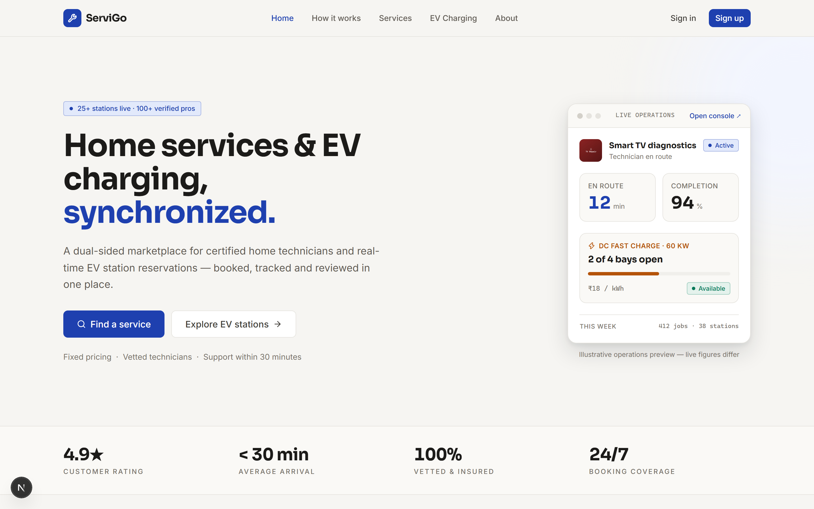
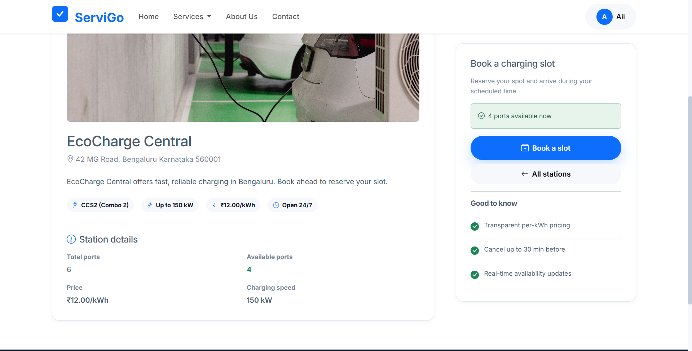
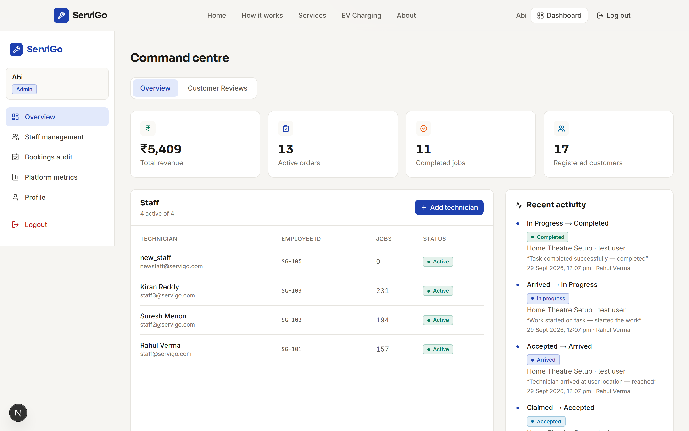
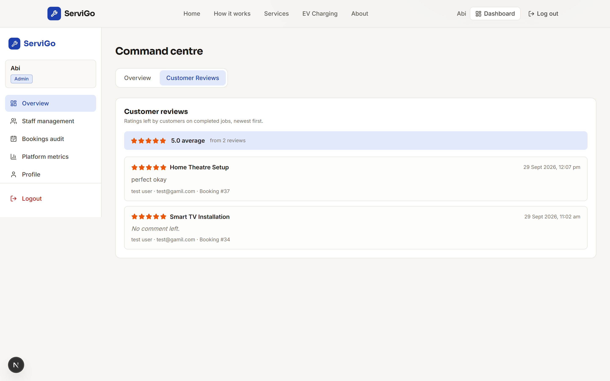
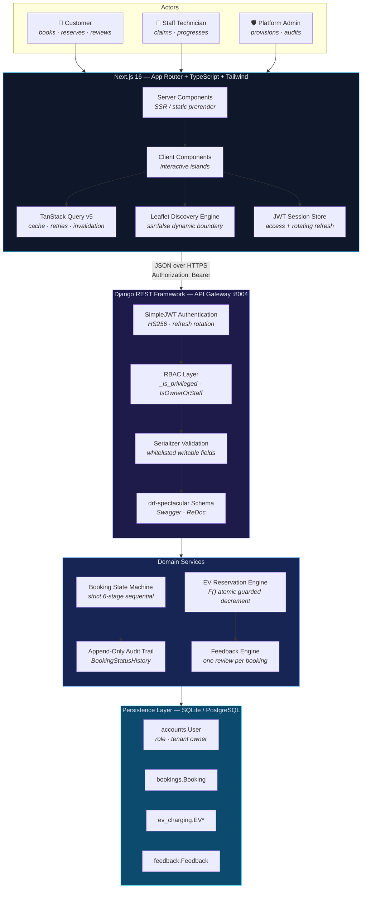

<div align="center">

# ⚙️ ServiGo

### Enterprise Urban Services & EV Mobility Platform

A full-stack dispatch and charging network platform that connects urban residents with
verified service professionals — electricians, plumbers, and Smart TV technicians —
alongside a live network of EV charging stations with real-time bay reservation.

Django 5.2 + Django REST Framework backend. Next.js 16 App Router + TypeScript frontend.
Role-isolated dashboards for customers, staff, and administrators.

---

[](https://servigo-web.onrender.com)
[](https://servigo-api.onrender.com/api/docs/)


</div>

---

## 🌐 Live Deployment

The platform is deployed and running — both tiers are live, so there is nothing to
install before you can click through it.

| | | |
| :-: | :-: | :-: |
| 🌐 **Live Web App**<br/>[https://servigo-web.onrender.com](https://servigo-web.onrender.com) | 📚 **API Docs (Swagger UI)**<br/>[https://servigo-api.onrender.com/api/docs/](https://servigo-api.onrender.com/api/docs/) | 🧩 **API Base**<br/>`https://servigo-api.onrender.com/api/` |

> Both services are hosted on Render with a managed Postgres database, so cold starts
> on the free tier can take a few seconds on the first request. Sign in with the demo
> accounts in [Demo Accounts](#demo-accounts) to reach the role-isolated dashboards.

---

## 📊 At A Glance

| | | | |
|:-:|:-:|:-:|:-:|
| **203**<br/>automated tests, all green | **6-Stage**<br/>linear dispatch state machine | **0-SSR**<br/>dynamic Leaflet boundary | **Atomic**<br/>`F()`-guarded bay decrement |

| | | | | |
|:-:|:-:|:-:|:-:|
| **3**<br/>tenant roles behind one API | **4**<br/>Django apps under strict boundaries | **24**<br/>REST endpoint groups | **1**<br/>append-only audit trail per booking |

---

## 📸 Interface Gallery

> Screenshots live in [`docs/screenshots/`](docs/screenshots/).

| | |
|:---:|:---:|
|  |  |
| *Landing — hero and service bento grid* | *EV discovery — geospatial station map and slot reservation* |
|  |  |
| *Staff dispatch — field technician stage queue* | *Admin hub — analytics and staff provisioning* |
|  | |
| *Customer feedback — platform-wide ratings and reviews moderation* | |

---

## 💼 Project Overview

ServiGo is a two-tier production monorepo. A **stateless JSON API gateway** built on
Django 5.2 and DRF owns every business rule, state transition, and authorization
decision. A **Next.js App Router** frontend owns presentation only.

The design principle is that **the client is a rendering layer, never a gate**. Every
permission is evaluated server-side against the authenticated principal; the UI merely
reflects decisions it has already been given.

Three roles share one codebase behind strict tenant boundaries:

| | 👤 Customer | 🔧 Staff Technician | 🛡️ Platform Admin |
| :-: | :-: | :-: | :-: |
| Books services | ✅ | — | — |
| Reserves EV bays | ✅ | — | — |
| Works a dispatch queue | — | ✅ | ✅ |
| Views platform analytics | — | — | ✅ |
| Provisions staff accounts | — | — | ✅ |

---

## 🏗️ System Architecture



**Request path in one line:** actor → Next.js client → bearer token → JWT authn →
RBAC object-level check → serializer validation → domain service → guarded `UPDATE` →
audit row.

---

## 💎 Engineering Highlights

### ⚛️ Database-Level Concurrency

EV charging stations are a **plain counter**, not a `select_for_update` inventory. The
last bay at a busy station is therefore contended state, and the naive read-then-write
(`if station.available_ports > 0: station.available_ports -= 1`) loses races by
design — two requests both read `1`, both pass the guard, and the station is
oversold.

ServiGo moves the guard **into the database statement itself** so the database's own
row lock arbitrates:

```python
# api/serializers.py — reserve a bay
held = (
    EVChargingStation.objects.filter(pk=station.pk, available_ports__gt=0)
    .update(available_ports=F("available_ports") - 1)
)
if not held:
    booking.delete()          # undo the phantom row, don't leave it orphaned
    raise serializers.ValidationError(
        {"station_id": "Every bay at this station was just reserved. Try another station."}
    )
```

Three properties make this correct:

1. **`F()` performs the arithmetic in SQL**, not in Python — no read-modify-write
   window exists for a second request to slip into.
2. **`available_ports__gt=0` is a conditional `UPDATE`**, so the capacity check and the
   decrement are a *single* atomic statement. The loser of the race gets `held == 0`
   instead of an oversold station.
3. **The counter is never allowed to go negative**, because the row can only ever be
   decremented while it is provably above zero.

Cancellation applies the mirror-image guard, clamping at true capacity so a double-cancel
cannot inflate the count:

```python
# api/views.py — return the bay
EVChargingStation.objects.filter(pk=booking.station_id).update(
    available_ports=Least(F("available_ports") + 1, F("total_ports"))
)
```

Pricing is likewise **server-authoritative**: the rate is read from the station row,
never the request payload, so a tampered client cannot quote itself a cheaper bay.

### 🔀 The Six-Stage State Machine

Booking status is not a free-text field. `Booking.LIFECYCLE` is the forward path —
`pending → claimed → accepted → arrived → in_progress → completed` — and transitions
are **adjacency-checked**, not merely "is this a valid value".

```python
@classmethod
def can_transition(cls, current, target):
    return cls.next_status(current) == target
```

`next_status()` returns the *single* status `current` may legally advance to, or
`None`. That gives four guarantees for free:

- **Out-of-order dispatch is refused** — a technician cannot mark a job complete from
  `pending`.
- **Replaying a stage is a 400, not a silent success** — a double-fired action is a
  client bug worth surfacing.
- **Unknown and non-adjacent statuses both fail**, so callers get one rule rather than
  a set of special cases.
- **`completed` and `cancelled` are terminal** — they live in `TERMINAL_STATUSES`, and
  a technician who realises they closed the wrong job needs a human to reopen it, not a
  second click.

`cancelled` is deliberately **not** a member of `LIFECYCLE`. It is declared after the
six stages in the enum and excluded from `OPEN_STATUSES`, so it can never be mistaken
for a step on the path, and a cancelled job never inflates the dispatch queue an
operator is reasoning about.

Every transition appends an immutable `BookingStatusHistory` row recording previous and
new status, actor, and timestamp. The trail is append-only: a mistake is corrected by a
new row, never by editing history.

Each stage also carries a fixed `MILESTONE_NOTES` sentence shown to the customer on
their timeline. That wording is a constant precisely because it must survive a
technician's free-text note, an admin's manual correction, and a future data import —
only a constant is guaranteed to.

### 🔒 Defense-in-Depth Security

The authorization layer was hardened against a real class of flaw, and the fix is worth
explaining because the original bug is a genuinely tempting mistake.

**The trap:** on a custom user model, `is_staff_user` / `is_admin_user` are
`@property` objects. So `getattr(user, "is_staff_user", False)` returns a *function
object* where the attribute exists — and a bare `if` over that object is **truthy no
matter what it would return**. Every account, including a plain customer, passes the
check. Django's native `is_staff` is the mirror image: it is a real `BooleanField`, so
`hasattr` succeeds for any defined value, *including* `False`.

**The fix** coerces to a real boolean before it can influence any decision, and keeps
the role string as the source of truth:

```python
def _is_privileged(user):
    if not (user and user.is_authenticated):
        return False
    if _role(user) in PRIVILEGED_ROLES:      # {"staff", "admin"}
        return True
    # Fall back to Django's own flags so an operator promoted through Django
    # admin (who never touches `role`) is not locked out of the API.
    return bool(getattr(user, "is_staff", False)) or bool(getattr(user, "is_superuser", False))
```

`IsOwnerOrStaff` then admits exactly one of two callers — a genuinely privileged
principal, or the record's actual owner. Ownership is compared on the **foreign key
id** rather than the related object, so a caller cannot influence the check by mutating
`obj.customer` in memory before the permission runs.

This property-introspection IDOR class is locked down by dedicated regression tests in
`tests/api/test_permissions.py`, including direct unit guards on `_is_privileged`
covering anonymous users, `None`, and a customer who has been mis-flagged.

### 🗺️ Zero-SSR Geolocation

Leaflet reads `window` and `navigator` at **module scope** — as soon as it is imported,
not when a map is mounted. A plain import from a server-rendered page therefore throws
during the Node render pass and takes down the whole route with a `window is not
defined` error. There is no way to fix this from inside the component, because the
crash happens before the component runs.

The import is moved behind a client boundary instead:

```tsx
// frontend/src/app/ev/page.tsx
const StationMap = dynamic(() => import("@/components/ev/StationMap"), {
  ssr: false,   // server renders a skeleton; the real map swaps in after hydration
});
```

The map and the station list are **one control, not two copies of the state**. Clicking
a pin sets the selected station and scrolls its card into view; selecting a card calls
`focusId`, and a `MapFocus` child pans the map to that pin. Marker colour is never a
client-side guess — the server computes an `availability_tone` from the operating status
*and* the free-to-total bay ratio, so a station down to its last third of bays is amber
and visually distinct from one that is closed.

### 💬 Post-Completion Feedback Pipeline

A rating may only be left by the customer who owns the booking, and only once the job
is actually complete. The rule is **"exactly once"**: a second `POST /api/feedback/` for
the same booking is a `400`, not a silent overwrite of the first review. Reviews then
surface to admins through a dedicated moderation endpoint rather than being visible on
the booking record itself.

---

## 👥 Role Matrix & Demo Credentials

Access is decided by a custom `User.role` field, checked against Django's native
`is_staff` / `is_superuser` flags. Only a genuinely privileged caller ever reaches
another tenant's record.

| Capability | 👤 Customer | 🔧 Staff | 🛡️ Admin |
| ---------- | :---------: | :------: | :------: |
| Browse services & EV stations | ✅ | ✅ | ✅ |
| Create a booking / reserve a bay | ✅ | — | — |
| Read **own** bookings | ✅ | ✅ | ✅ |
| Read **any** booking | ❌ | ✅ | ✅ |
| Cancel own pending booking | ✅ | — | — |
| Claim & progress assigned jobs | ❌ | ✅ | — |
| View staff dispatch queue | ❌ | ✅ | ✅ |
| Provision staff accounts | ❌ | ❌ | ✅ |
| Platform-wide metrics | ❌ | ❌ | ✅ |
| Moderate all feedback | ❌ | ❌ | ✅ |

> **Privilege escalation is closed at registration.** Only `customer` and `staff` may
> self-register through the public form. The `role` field is server-owned and read-only
> on the wire; admin accounts exist only via the seed command or Django admin.

### Demo Accounts

| Role | Email | Password | Lands on |
| ---- | ----- | -------- | -------- |
| 👤 Customer | `customer@servigo.com` | `customer12345` | Customer dashboard |
| 🔧 Staff Technician | `staff@servigo.com` | `staff12345` | Staff dispatch queue |
| 🛡️ Platform Admin | `admin@servigo.com` | `admin12345` | Admin aggregation hub |

> ⚠️ **Demo credentials only.** These exist for local evaluation against a seeded
> database. Any real deployment must rotate them and serve over HTTPS — bearer tokens
> issued over plaintext are trivially interceptable.

---

## 🔌 API Surface

All endpoints are namespaced under `/api/` and documented live via `drf-spectacular`.

| Group | Endpoint | Method | Access |
| ----- | -------- | ------ | ------ |
| **Auth** | `/api/auth/register/` | `POST` | Public |
| | `/api/auth/login/` | `POST` | Public |
| | `/api/auth/refresh/` | `POST` | Refresh token |
| | `/api/auth/me/` | `GET` | Authenticated |
| | `/api/auth/profile/` | `PATCH` | Authenticated |
| **Catalogue** | `/api/service-categories/` | `GET` | Public |
| | `/api/services/` | `GET` | Public |
| | `/api/services/<id>/` | `GET` | Public |
| **Bookings** | `/api/bookings/` | `GET` `POST` | Authenticated |
| | `/api/bookings/<id>/` | `GET` `PATCH` | Owner / staff / admin |
| | `/api/bookings/<id>/cancel/` | `POST` | Owner / staff / admin |
| **EV Charging** | `/api/ev/stations/` | `GET` | Public |
| | `/api/ev/stations/<id>/` | `GET` | Public |
| | `/api/ev/bookings/` | `GET` `POST` | Authenticated |
| | `/api/ev/bookings/<id>/` | `GET` | Owner / staff / admin |
| | `/api/ev/bookings/<id>/cancel/` | `POST` | Owner / staff / admin |
| **Staff** | `/api/staff/bookings/` | `GET` | Staff |
| | `/api/staff/bookings/<id>/assign/` | `POST` | Staff |
| | `/api/staff/bookings/<id>/status/` | `POST` | Staff |
| | `/api/staff/bookings/<id>/actions/` | `POST` | Staff |
| **Admin** | `/api/admin/staff/` | `GET` `POST` | Admin |
| | `/api/admin/metrics/` | `GET` | Admin |
| | `/api/admin/feedback/` | `GET` | Admin |
| **Feedback** | `/api/feedback/` | `POST` | Booking owner |

---

## ⚙️ Local Development

**Prerequisites:** Python 3.12+ (tested on 3.13), Node.js 20+, npm 10+.

The backend and frontend run as **two independent processes in two terminals**. They are
never served as one process.

### 1. Clone the repository

```bash
git clone https://github.com/Aby020/ServiGo.git
cd ServiGo
```

### 2. Backend setup

```bash
# Create and activate a virtual environment
python -m venv venv
source venv/Scripts/activate        # Windows Git Bash
# source venv/bin/activate           # macOS / Linux
# source .venv/Scripts/activate     # Windows PowerShell

# Install dependencies
pip install -r requirements.txt

# Configure the environment
cp .env.example .env                 # macOS / Linux
# copy .env.example .env             # Windows
python -c "import secrets; print(secrets.token_urlsafe(50))"   # paste into SECRET_KEY

# Create the database and seed demo accounts, services, stations and bookings
python manage.py migrate
python manage.py seed_demo

# Start the API on port 8004
python manage.py runserver 8004
```

### 3. Frontend setup

```bash
cd ServiGo/frontend
npm install

# Point the client at the API (defaults to http://127.0.0.1:8004 if unset)
echo "NEXT_PUBLIC_API_URL=http://127.0.0.1:8004" > .env.local

npm run dev
```

Open **http://localhost:3000**.

### 4. Verify the install

```bash
# Backend test suite — 203 tests
python manage.py test tests

# OpenAPI schema validation — expect 0 warnings, exit code 0
python manage.py spectacular --file schema.yml --validate

# Frontend production build — expect 0 errors
cd frontend && npm run build
```

### API documentation

Running locally:

| | |
| :-: | :-: |
| **Swagger UI** | http://127.0.0.1:8004/api/docs/ |
| **ReDoc** | http://127.0.0.1:8004/api/schema/redoc/ |
| **Raw schema** | http://127.0.0.1:8004/api/schema/ |

Live deployment:

| | |
| :-: | :-: |
| **API base** | https://servigo-api.onrender.com/api/ |
| **Swagger UI** | https://servigo-api.onrender.com/api/docs/ |
| **ReDoc** | https://servigo-api.onrender.com/api/schema/redoc/ |
| **Raw schema** | https://servigo-api.onrender.com/api/schema/ |

---

## 🧪 Testing & Quality Assurance

**203 automated tests**, all passing — the suite is the enforcement mechanism for the
guarantees above, not a formality.

| Suite | Tests | Covers |
| ----- | :---: | ------ |
| `tests/accounts/test_models.py` | 14 | Custom user model, role field, constraints |
| `tests/accounts/test_forms.py` | 10 | Registration, validation, role assignment |
| `tests/accounts/test_views.py` | 32 | Login, logout, profile, dashboard routing |
| `tests/accounts/test_backends.py` | 11 | Authentication backends, role resolution |
| `tests/api/test_permissions.py` | 18 | **IDOR regression**, `_is_privileged` unit guards |
| `tests/api/test_staff_actions.py` | 18 | Sequential stage actions, replay and reorder refusal |
| `tests/api/test_staff_dispatch.py` | 24 | Claim, assign, queue scoping, concurrent claim |
| `tests/api/test_admin.py` | 36 | Metrics aggregation, staff provisioning, feedback moderation |
| `tests/api/test_register.py` | 21 | Public registration, privilege escalation closure |
| `tests/api/test_feedback.py` | 19 | One-review-per-booking, ownership, completion gate |

---

## 📁 Project Layout

```text
ServiGo/
├── config/              # Django settings, root URLconf, ASGI/WSGI
├── accounts/            # Custom user model, roles, auth backends
├── services/            # Service catalogue (categories, providers)
├── bookings/            # Booking state machine + append-only history
├── ev_charging/         # EV stations, bay inventory, reservations
├── feedback/            # Post-completion review pipeline
├── dashboard/           # Server-rendered staff/admin Django views
├── core/                # Shared utilities, seed_demo management command
├── api/                 # DRF viewsets, serializers, permissions
│   ├── permissions.py   # RBAC: _is_privileged, IsOwnerOrStaff, IsAdminUser
│   ├── serializers.py   # Validation + F() guarded bay reservation
│   └── views.py         # All /api/ endpoints
├── templates/           # Django HTML templates
├── static/              # Static assets
├── tests/               # 203-test suite, split per app
├── frontend/            # Next.js App Router + TypeScript + Tailwind
│   └── src/
│       ├── app/         # Routes: /, /services, /ev, /bookings, /dashboard/*
│       ├── components/  # ev/, ui/, dashboard/ feature components
│       └── lib/         # API client, query config, session store
├── docs/screenshots/    # Interface gallery assets
├── requirements.txt
└── manage.py
```

---

## 📄 License

Released for portfolio and evaluation purposes. All rights reserved.

---

<div align="center">

**ServiGo** — built with Django 5.2, Next.js 16, TypeScript, and Tailwind CSS.

</div>
