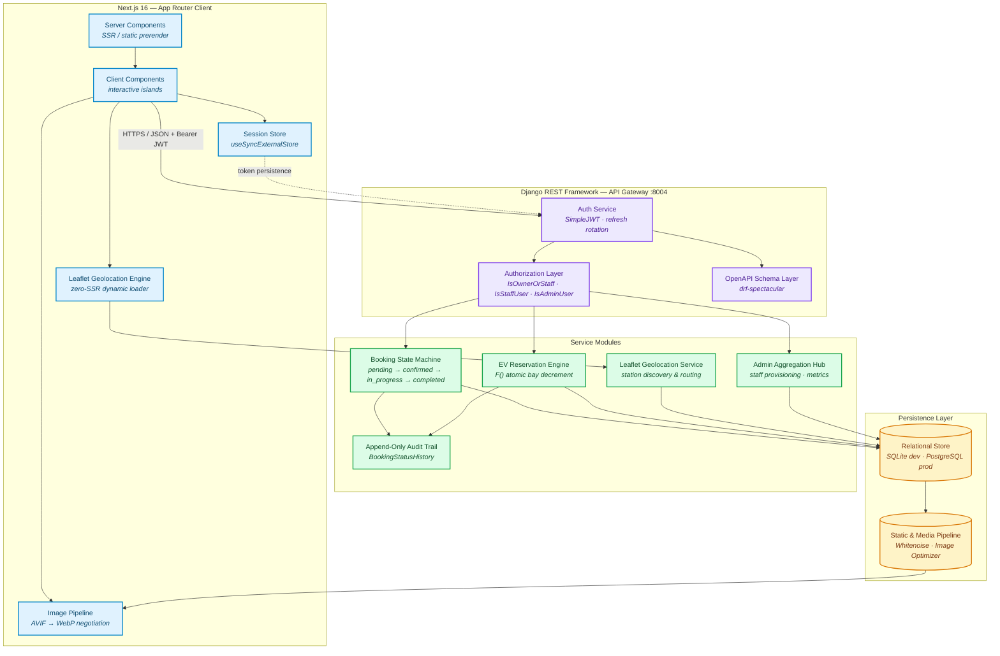

<div align="center">

# ⚡ ServiGo

### Enterprise Urban Services & EV Mobility Platform

**A production-grade marketplace that connects urban residents with verified service professionals — electricians, plumbers, and Smart TV technicians — alongside a live network of EV charging stations with real-time bay reservation.**

Django 5.2 + Django REST Framework backend. Next.js 16 App Router frontend. Role-isolated dashboards for customers, staff, and administrators.

[](https://www.djangoproject.com/)
[](https://www.django-rest-framework.org/)
[](https://nextjs.org/)
[](https://www.typescriptlang.org/)
[](https://tailwindcss.com/)
[](https://tanstack.com/query)
[](https://leafletjs.com/)
[](https://github.com/jazzband/djangorestframework-simplejwt)
[](https://spec.openapis.org/oas/v3.0.3)
[](#testing--quality-assurance)

---

`Django REST API` · `Next.js App Router` · `PostgreSQL / SQLite` · `Role-Based Access Control` · `Concurrency-Safe Reservations`

</div>

---

## 📑 Table of Contents

- [System Architecture](#-system-architecture)
- [Engineering Highlights](#-engineering-highlights)
- [Role Matrix & Demo Accounts](#-role-matrix--demo-accounts)
- [Local Setup](#-local-setup)
- [API Documentation](#-api-documentation)
- [API Surface](#-api-surface)
- [Testing & Quality Assurance](#-testing--quality-assurance)
- [Project Layout](#-project-layout)

---

## 🏗️ System Architecture

ServiGo is a two-tier system: a **stateless JSON API gateway** that owns all business rules, and a **server-rendered React client** that owns presentation. Every authorization decision lives server-side — the frontend is a rendering layer, never a gate.



**Request lifecycle.** A browser request hits the Next.js App Router, which renders on the server and hydrates on the client. Authenticated calls carry a JWT bearer token to the DRF gateway. The gateway authenticates, applies the **Authorization Layer** (object-level permissions evaluated per-resource, never per-route), routes to a service module, and persists through Django's ORM. Responses return as JSON; the client invalidates the TanStack Query cache rather than refetching imperatively.

**Defense in depth.** The four layers below are independent — a mistake in one does not open the system, because the next one still holds:

| Layer | Enforces |
| ----- | -------- |
| **Client** | Zod schema validation on every mutation before it reaches the network |
| **Gateway** | JWT authentication, then coarse role permission (`IsCustomer`, `IsStaffUser`, `IsAdminUser`) |
| **Object** | `IsOwnerOrStaff` — tenant scoping evaluated per object, not per route |
| **Data** | Server-authoritative derived values (pricing, capacity) that ignore client input |

---

## 💎 Engineering Highlights

### 🔒 Zero-Trust Security

**Anti-IDOR object permissions.** `IsOwnerOrStaff` is the platform's tenant boundary. It grants access on exactly one of two conditions: the caller is genuinely privileged, or the caller *is* the record's owner.

The subtlety worth calling out: privilege must be determined by the **value** of a flag, never by its **presence**. The original implementation branched on `hasattr(user, "is_staff_user")`, which answers "does this attribute exist?" — and since `is_staff_user` is a `@property` on the user model, it exists for *every* account, customer included. The property's own return value was never consulted. The result was a textbook Insecure Direct Object Reference: any authenticated user could read any other customer's booking by changing the id in the URL.

```python
# ❌ Attribute presence is not consent — every account passes this branch.
if hasattr(user, "is_staff_user") and user.is_staff_user:
    return True

# ✅ Value of the flag, coerced to a real boolean, decides.
is_staff = _role(user) in PRIVILEGED_ROLES
```

The hardened version resolves ownership from `obj.customer_id` — a plain id comparison, no extra query, no dependence on a cached related object that a caller could manipulate before the check runs. `tests/api/test_permissions.py` locks the behaviour in with 18 tests, including the cross-tenant 403, enumeration resistance, and a direct assertion that privilege is *never* decided by attribute presence.

**Server-authoritative economics.** A client cannot quote itself a cheaper charging session. `estimated_cost` is always recomputed from the station's own `price_per_kwh` row, never read from the request payload — a tampered client gets the real price or a 400.

**Documented API surface.** `drf-spectacular` generates the OpenAPI 3 schema from the serializers themselves, so the docs cannot drift from the code that enforces them. Enum names are explicitly overridden to keep the schema stable across unrelated changes — and, more importantly, to stop a *service booking* status from ever being sent where an *EV reservation* status is expected. Read-only fields are excluded from `required` arrays, so generated clients are never told to send server-owned fields like `role`.

### ⚡ Concurrency-Safe Reservations

The last charging bay at a station is the classic oversell race: two requests read `available_ports == 1`, both decide they may reserve, and the station is now double-booked.

ServiGo resolves this **in the database, not in Python** — the `UPDATE` statement itself is the guard:

```python
held = (
    EVChargingStation.objects.filter(pk=station.pk, available_ports__gt=0)
    .update(available_ports=F("available_ports") - 1)
)
if not held:
    booking.delete()   # undo the write; never leave a phantom reservation
    raise ValidationError({"station_id": "Every bay was just reserved."})
```

Three properties make this correct under load:

1. **`F()` expressions** evaluate in the database, so the read-modify-write is a single atomic `UPDATE` — no lost updates.
2. **The condition is in the `WHERE` clause**, not in Python. The row is claimed and decremented or the statement affects nothing; there is no window between "check" and "act".
3. **Compensating delete on failure.** The booking row is written before the counter is claimed, so a lost race explicitly unwinds the write rather than leaving an orphan reservation against a station with nothing left.

Cancelling reverses the operation with the same `F()` discipline, clamping at `total_ports` so a double-cancel cannot inflate availability beyond physical capacity.

### 🧭 Audit Trail & State Machine

Every booking status change writes an **append-only** `BookingStatusHistory` row recording the previous status, the new status, the acting user, and a timestamp. History is never updated or deleted — the record of what happened is more valuable than the convenience of editing it.

Transitions are role-gated: customers may cancel their own pending booking, staff may claim and progress jobs they are assigned, and terminal states (`completed`, `cancelled`) are refused for further movement. The staff-side write is asserted in tests to include `changed_by` — because the *customer's* timeline renders the technician's name, and a history row written without it would leave the audit trail silently anonymous.

### ⚛️ Client-Side Optimization

**Zero-SSR Leaflet.** Leaflet touches `window` at import time, so it is loaded through a dynamic `ssr: false` boundary and rendered only in the browser. A static import would break the server render outright.

**Deterministic hydration.** Session presence is read via `useSyncExternalStore`, not `useState` + `useEffect`. The server snapshot is `false` (no `localStorage` on the server); the client re-reads immediately after hydration. The two agree on first render and diverge only afterwards — the sanctioned pattern for reading something the server cannot see, and it avoids the extra render pass that seeding state in an effect costs. The snapshot is a boolean, so it is `Object.is`-stable and will not loop.

**Negotiated image delivery.** The category and service photography runs 175–300 KB per image, a dozen of them on the home page. AVIF and WebP variants are negotiated per-request via `Accept`, with the original JPEG as the fallback for browsers supporting neither — no sniffing round-trip, no broken image. The longest edge is capped at 1920px so a 4K upload is never re-encoded at 3840px for a card that never paints more than ~640px.

---

## 👥 Role Matrix & Demo Accounts

Access is decided by a custom `User.role` field, checked against Django's native `is_staff` / `is_superuser` flags. Only a genuinely privileged caller reaches another tenant's record.

| Capability | 👤 Customer | 🔧 Staff | 🛡️ Admin |
| ---------- | :---------: | :------: | :------: |
| Browse services & EV stations | ✅ | ✅ | ✅ |
| Create a booking / reserve a bay | ✅ | — | — |
| Read **own** bookings | ✅ | ✅ | ✅ |
| Read **any** booking | ❌ | ✅ | ✅ |
| Cancel own pending booking | ✅ | — | — |
| Claim & progress assigned jobs | ❌ | ✅ | — |
| Change booking status | ❌ | ✅ | ✅ |
| View staff dispatch queue | ❌ | ✅ | ✅ |
| Provision staff accounts | ❌ | ❌ | ✅ |
| Platform-wide metrics | ❌ | ❌ | ✅ |

> **Privilege escalation is closed at registration.** Only `customer` and `staff` may self-register through the public form. The `role` field is server-owned and read-only on the wire; admin accounts exist only via the seed command or Django admin.

### Demo Accounts

| Role | Email | Password | Lands on |
| ---- | ----- | -------- | -------- |
| 👤 Customer | `customer@servigo.com` | `customer12345` | Customer dashboard |
| 🔧 Staff | `staff@servigo.com` | `staff12345` | Staff dispatch queue |
| 🛡️ Admin | `admin@servigo.com` | `admin12345` | Admin aggregation hub |

> ⚠️ **Demo credentials only.** These exist for local evaluation against a seeded database. Any real deployment must rotate them and serve over HTTPS — JWTs issued over plaintext are trivially interceptable.

---

## 🚀 Local Setup

**Prerequisites:** Python 3.12+, Node.js 20+, npm 10+.

### 1. Backend

```bash
# Clone and enter the project
cd D:\AbiLabs\ServiGo

# Create and activate a virtual environment
python -m venv venv
venv\Scripts\activate          # Windows
# source venv/bin/activate     # macOS / Linux

# Install dependencies
pip install -r requirements.txt

# Configure the environment
copy .env.example .env         # Windows
# cp .env.example .env         # macOS / Linux
# Generate a secret key and paste it into .env:
#   python -c "import secrets; print(secrets.token_urlsafe(50))"

# Create the database and seed demo data
python manage.py migrate
python manage.py seed_demo     # creates the three demo accounts above

# Start the API server
python manage.py runserver 127.0.0.1:8004
```

Backend is live at **http://127.0.0.1:8004** — API at `/api/`, Swagger UI at `/api/docs/`.

> A convenience launcher is included: `.\scripts\run_dev.ps1 [port]` starts the server on the project venv with the correct Django version.

### 2. Frontend

```bash
cd D:\AbiLabs\ServiGo\frontend

# Install dependencies
npm install

# Configure the API endpoint
copy .env.example .env.local   # Windows — already points at http://127.0.0.1:8004

# Start the dev server
npm run dev
```

Frontend is live at **http://localhost:3000**.

> **Port pairing matters.** The frontend calls `NEXT_PUBLIC_API_URL`; Django's CORS allowlist permits `localhost:3000` and `127.0.0.1:3000` only. Changing either port means updating both sides or the browser will reject every call.

### 3. Verify the install

```bash
# Backend test suite — 165 tests
python manage.py test tests

# OpenAPI schema validation — expect 0 warnings, exit code 0
python manage.py spectacular --validate

# Frontend production build — expect 0 errors
cd frontend && npm run build
```

---

## 📚 API Documentation

The schema is generated from the serializers by `drf-spectacular`, so it is impossible for the published contract to drift from the enforced one.

| Resource | URL | What it serves |
| -------- | --- | -------------- |
| **Swagger UI** | `/api/docs/` | Interactive explorer — try every endpoint with a bearer token |
| **OpenAPI schema** | `/api/schema/` | Raw OpenAPI 3.0 document (YAML) |
| **Schema only** | `/api/schema/swagger-ui/` | ReDoc reference rendering of the same document |

Validate the schema at any time — the command exits non-zero and prints every warning:

```bash
python manage.py spectacular --validate
```

---

## 🔌 API Surface

All routes are prefixed with `/api/`. Authenticated endpoints require an `Authorization: Bearer <access_token>` header; obtain one from `POST /api/auth/login/`.

### Authentication

| Method | Endpoint | Access | Description |
| ------ | -------- | ------ | ----------- |
| `POST` | `/api/auth/register/` | Public | Create a customer or staff account |
| `POST` | `/api/auth/login/` | Public | Exchange credentials for an access + refresh pair |
| `POST` | `/api/auth/refresh/` | Refresh token | Rotate the access token |
| `GET` | `/api/auth/me/` | Authenticated | Current user profile and role |
| `PATCH` | `/api/auth/profile/` | Authenticated | Update own profile (scoped to the caller) |

### Catalogue

| Method | Endpoint | Access | Description |
| ------ | -------- | ------ | ----------- |
| `GET` | `/api/service-categories/` | Public | Service categories |
| `GET` | `/api/services/` | Public | Service catalogue, paginated |
| `GET` | `/api/services/<id>/` | Public | Service detail |
| `GET` | `/api/ev/stations/` | Public | EV stations — filter by city, charger type, price, availability |
| `GET` | `/api/ev/stations/<id>/` | Public | Station detail with live port availability |

### Bookings

| Method | Endpoint | Access | Description |
| ------ | -------- | ------ | ----------- |
| `GET` | `/api/bookings/` | Authenticated | Own bookings (staff and admin: all) |
| `POST` | `/api/bookings/` | Customer | Create a booking |
| `GET` | `/api/bookings/<id>/` | Owner, staff, admin | Booking detail with its audit trail |
| `POST` | `/api/bookings/<id>/cancel/` | Owner | Cancel a pending or confirmed booking |

> **Cross-tenant access returns `403 Forbidden`, not `404`.** A customer requesting another customer's booking id is refused explicitly, and the response body contains no part of the victim's record. See `tests/api/test_permissions.py`.

### EV Charging

| Method | Endpoint | Access | Description |
| ------ | -------- | ------ | ----------- |
| `GET` | `/api/ev/bookings/` | Authenticated | Own reservations (staff and admin: all) |
| `POST` | `/api/ev/bookings/` | Customer | Reserve a bay — atomically, cost derived server-side |
| `GET` | `/api/ev/bookings/<id>/` | Owner, staff, admin | Reservation detail |
| `POST` | `/api/ev/bookings/<id>/cancel/` | Owner | Cancel and return the bay to the pool |

### Staff & Admin

| Method | Endpoint | Access | Description |
| ------ | -------- | ------ | ----------- |
| `GET` | `/api/staff/bookings/` | Staff | Dispatch queue — filter by `assigned=unassigned\|mine\|all` |
| `POST` | `/api/staff/bookings/<id>/assign/` | Staff | Claim a job; writes an audit row |
| `POST` | `/api/staff/bookings/<id>/status/` | Staff | Advance the booking state machine |
| `GET` | `/api/admin/staff/` | Admin | List staff accounts |
| `POST` | `/api/admin/staff/` | Admin | Provision a staff account |
| `GET` | `/api/admin/metrics/` | Admin | Platform-wide aggregate statistics |

---

## 🧪 Testing & Quality Assurance

```bash
python manage.py test tests          # 165 tests
```

| Suite | Focus |
| ----- | ----- |
| `tests/api/test_permissions.py` | Cross-tenant authorization — the 403 regression and its neighbourhood |
| `tests/api/test_staff_dispatch.py` | Dispatch queue, job claiming, legal vs. illegal status transitions |
| `tests/api/test_admin.py` | Admin-only guards on provisioning and metrics |
| `tests/api/test_register.py` | Registration, role assignment, privilege-escalation attempts |
| `tests/accounts/` | Custom user model, role properties, backends, forms |

Authorization tests are written to fail if the security property is ever weakened again — the cross-tenant 403 is asserted as an exact status code, and the response body is checked for leakage of the victim's email and price.

---

## 📁 Project Layout

```
ServiGo/
├── config/                  # Django settings, root URLconf, WSGI
├── accounts/                # Custom User model, auth backends, password reset
├── services/                # Service catalogue (categories, services)
├── bookings/                # Booking model, state machine, status history
├── ev_charging/             # EV stations, reservations, bay inventory
├── dashboard/               # Role-scoped server-rendered dashboards
├── api/                     # DRF views, serializers, permissions, OpenAPI schema
├── core/                    # Home, about, contact
├── tests/                   # Test suite (165 tests)
├── scripts/                 # Dev launcher, auth & EV smoke verification
├── frontend/                # Next.js 16 App Router (TypeScript, Tailwind 4)
│   ├── src/app/             # Route segments (bookings, dashboard, ev, services)
│   ├── src/components/      # Reusable UI
│   └── src/lib/             # API client, session store, image + form helpers
├── requirements.txt
└── manage.py
```

---

## 📄 License

Released under the **MIT License**.

---

<div align="center">
  <sub>Built with Django, Next.js, and an unreasonable amount of care about authorization.</sub>
</div>
