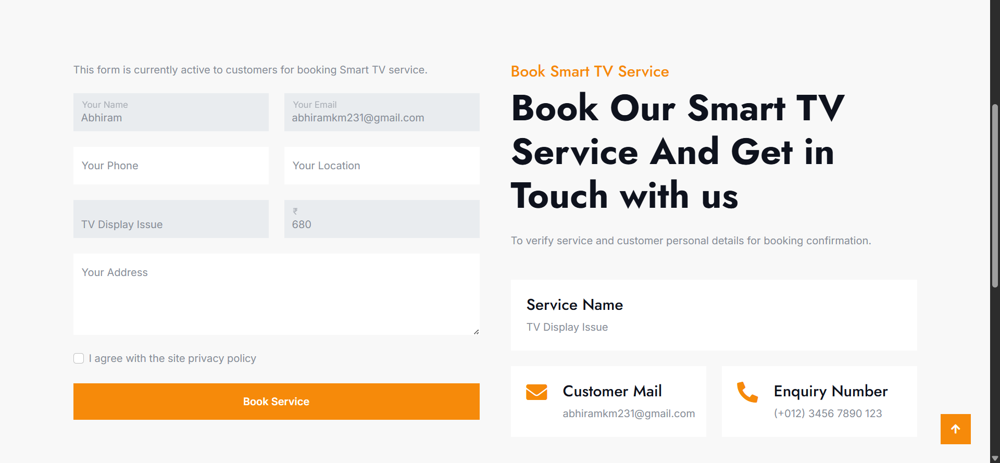
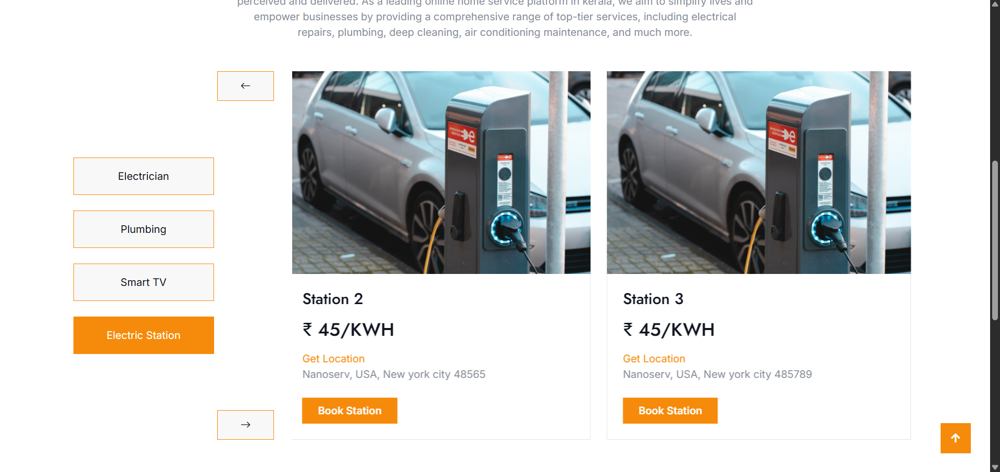
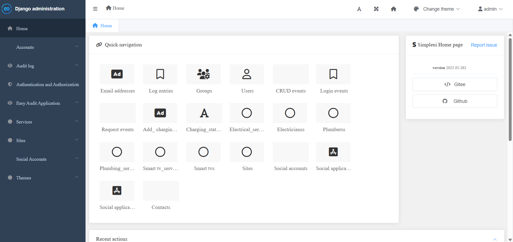
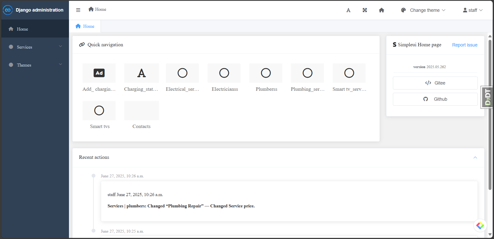

# 🏠 ServiGo

<div align="center">

### Home Services & EV Charging Platform

A full-featured home-services booking platform that connects customers with verified local professionals — electricians, plumbers, Smart TV experts and more — alongside a live network of EV charging stations with slot booking. Built on Django with role-based dashboards for customers, staff, and administrators.


</div>

<p align="center">
  
=======

# ⚡ NanoServ

<div align="center">

### Professional Home Services & EV Charging Booking Platform

A modern full-stack Django web application that simplifies home service bookings and EV charging station reservations through secure authentication, role-based management, and an intuitive user experience.


</div>
<p align="center">
  

</p>

## 📖 Project Overview

NanoServ is a full-stack Django web application designed to simplify the process of booking home maintenance services and EV charging stations through a single, user-friendly platform.

The platform enables customers to quickly book services such as electrical repairs, plumbing, Smart TV maintenance, and EV charging while providing administrators and staff with powerful management tools for handling bookings, services, customer requests, and operational workflows.

Built with Django and Bootstrap, NanoServ focuses on usability, security, and maintainability while demonstrating practical implementation of authentication, CRUD operations, email notifications, role-based access control, and responsive web design.

Whether managing home services or electric vehicle charging infrastructure, NanoServ provides a streamlined digital solution for both customers and service providers.

## ✨ Key Features

### 👤 Authentication & User Management
- Secure user registration and login
- Role-based access control (Admin, Staff, Customer)
- Password reset functionality
- Session management and account security
- Email verification and authentication support

### 🔧 Home Service Management
- Browse available home services
- Electrical service booking
- Plumbing service booking
- Smart TV repair booking
- Detailed service information with pricing
- Online booking confirmation

### ⚡ EV Charging Station Booking
- Browse available charging stations
- View charging station details and pricing
- Google Maps location integration
- Reserve charging slots
- Booking confirmation workflow

### 📊 Admin & Staff Dashboard
- Centralized administration panel
- Staff dashboard for operational management
- Manage services and pricing
- Customer booking management
- Contact request management
- Service history monitoring

### 📧 Communication & Notifications
- Email confirmation for bookings
- Contact form support
- Customer inquiry management
- Booking status communication

### 🔒 Security Features
- Django Authentication System
- Django Allauth integration
- Login protection using Django Axes
- Audit logging for critical operations
- Smart rate limiting for request protection

### 🎨 User Experience
- Modern responsive interface
- Mobile-friendly design
- Bootstrap 5 components
- Easy navigation
- Clean and intuitive booking workflow

## 📸 Screenshots

### 🏠 Home Page


---

### 🛠️ Services Page


---

### 📝 Service Booking Form


---


---

### ⚡ EV Charging Station Booking


---

### 🛡️ Admin Dashboard


---

### 👨‍💼 Staff Dashboard


---

### 🏡 Staff Home Page


### 📝 Service Booking

Customers can book their preferred service by providing their contact information and appointment details.

<p align="center">
  
</p>

### ⚡ EV Charging Station Booking

Browse charging stations, view pricing, and reserve charging slots through a dedicated booking interface.

<p align="center">
  
</p>

---

### 🛠️ Django Administration Panel

Administrators can manage users, services, bookings, and application data through Django's customized admin interface.

<p align="center">
  
</p>

---

### 👨‍💼 Staff Dashboard

Staff members can efficiently monitor bookings, manage customer requests, and oversee daily service operations.

<p align="center">
  
</p>

## 🛠️ Technology Stack

| Category | Technologies |
|-----------|--------------|
| **Backend** | Python, Django 5.2 |
| **Frontend** | HTML5, CSS3, Bootstrap 5, JavaScript |
| **Database** | SQLite3 |
| **Authentication** | Django Authentication, Django Allauth |
| **Forms** | Django Crispy Forms, Crispy Bootstrap 4 |
| **Security** | Django Axes, Django Auditlog, Django Easy Audit, Django Smart RateLimit |
| **Email Services** | SMTP (Gmail) |
| **Development Tools** | VS Code, Git, GitHub |
| **Libraries** | Pillow, Django Browser Reload, Django Debug Toolbar |
| **Deployment Ready** | Python Virtual Environment, Environment Variables (.env) |

## 📂 Project Structure

```text
NanoServ/
│
├── NanoServ/                 # Django project configuration
├── account_manager/          # Authentication & user management
├── services/                 # Home services & EV charging modules
├── crm/                      # Staff & booking management
├── themes/                   # Website pages (Home, About, Contact)
├── templates/                # HTML templates
├── static/                   # CSS, JavaScript & assets
├── media/                    # Uploaded service images
├── screenshots/              # README screenshots
│
├── manage.py
├── requirements.txt
├── README.md
└── .env
```

## 🏗️ System Architecture

```text
                    Client Browser
                          │
                          ▼
                 Bootstrap 5 Interface
                          │
                          ▼
                  Django URL Routing
                          │
                          ▼
                 Django Views & Logic
                          │
          ┌───────────────┼───────────────┐
          ▼               ▼               ▼
 Authentication      Booking Module     CRM Module
          │               │               │
          └───────────────┼───────────────┘
                          ▼
                    SQLite Database
                          │
                          ▼
                  Email Notifications
```

## ⚙️ Installation & Setup

### 1️⃣ Clone the Repository

```bash
git clone https://github.com/Aby020/NanoServ.git
cd NanoServ
=======
# 🏠 NanoServ – Home Service Booking Platform

A modern **Home Service Booking Platform** built with **Django**, **Python**, and **MySQL** that connects users with trusted service providers through a simple and responsive web interface.


## ✨ Features

- 👤 User authentication
- 🏠 Home service booking
- 📍 Location-based service discovery
- 🔍 Search and filtering
- 📅 Booking management
- 🛠️ Service provider dashboard
- 📱 Responsive interface

---

## 🛠️ Tech Stack


| Layer | Technology |
|-------|-----------|
| **Backend** | Django 5.2, Python 3.12 |
| **Frontend** | Bootstrap 5, Bootstrap Icons, Crispy Forms |
| **Database** | SQLite (dev) · PostgreSQL (production, via `DATABASE_URL`) |
| **Auth** | Custom `User` model (email as `USERNAME_FIELD`), email-or-username backend |
| **Media / Assets** | Pillow, Django static & media handling |
| **Tooling** | django-environ (env config), django-browser-reload (dev) |

---

## 🏗️ Project Structure

```
ServiGo/
├── accounts/          # Custom User, authentication, registration, profiles
├── services/          # Service categories & catalogue, image handling
├── bookings/          # Service bookings, status workflow & history
├── ev_charging/       # EV stations & charging slot bookings
├── dashboard/         # Role-based dashboards (customer / staff)
├── core/              # Home page, shared views & context
├── config/            # Django project settings (settings, urls, wsgi)
├── templates/         # Shared + per-app HTML templates
├── static/            # CSS, JS, images
├── media/             # User-uploaded media
├── tests/             # Test suite (per-app packages)
├── scripts/           # Dev helpers (run_dev.ps1, verify_auth.py)
├── manage.py
└── requirements.txt
=======
**Frontend**
- HTML5
- CSS3
- JavaScript

**Backend**
- Python
- Django

**Database**
- MySQL

**Tools**
- Git
- GitHub
- VS Code

---

## 📂 Project Structure

```
NanoServ
│
├── accounts/
├── services/
├── bookings/
├── templates/
├── static/
├── manage.py
└── requirements.txt

```

---


## 🚀 Installation & Setup

**Prerequisites:** Python 3.12, Git.

```bash
# 1. Clone the repository
git clone https://github.com/Aby020/ServiGo.git
cd ServiGo

# 2. Create and activate a virtual environment
python -m venv venv
venv\Scripts\activate          # Windows
# source venv/bin/activate    # macOS / Linux

# 3. Install dependencies
pip install -r requirements.txt

# 4. Apply database migrations
python manage.py migrate

# 5. Create a superuser (admin)
python manage.py createsuperuser

# 6. (Optional) Seed demo data — categories, services, EV stations, demo users
python manage.py seed_demo

# 7. Run the development server
python manage.py runserver 127.0.0.1:8004
```

Open <http://127.0.0.1:8004> in your browser. On Windows you can use the shortcut launcher instead:

```powershell
.\scripts\run_dev.ps1          # starts on 127.0.0.1:8004
=======

### 2️⃣ Create a Virtual Environment

#### Windows

```bash
python -m venv .venv
.venv\Scripts\activate
```

#### Linux / macOS

```bash
python3 -m venv .venv
source .venv/bin/activate
```

---

### 3️⃣ Install Dependencies
=======
## 🌐 Live Demo

🚀 Experience the application online:

**🔗 https://nanoserv.pythonanywhere.com/**

---

## 🚀 Getting Started

Clone the repository

```bash
git clone https://github.com/Aby020/Nanoserv.git
```

Install dependencies
>>>>>>> 20ead8afc1b1537de3f9a9f5a6a79e098fa95922

```bash
pip install -r requirements.txt
```


---

### 4️⃣ Configure Environment Variables

Create a `.env` file in the project root.

Example:

```env
SECRET_KEY=your_secret_key
DEBUG=True

EMAIL_HOST=smtp.gmail.com
EMAIL_PORT=587
EMAIL_USE_TLS=True
EMAIL_HOST_USER=your_email@gmail.com
EMAIL_HOST_PASSWORD=your_app_password
SERVER_EMAIL=your_email@gmail.com
```

---

### 5️⃣ Apply Database Migrations

```bash
python manage.py migrate
```

---

### 6️⃣ Create an Administrator Account

```bash
python manage.py createsuperuser

```

---


## ⚙️ Environment Variables

Create a `.env` file in the project root (or rely on sensible defaults):

| Variable | Description | Default |
|----------|-------------|---------|
| `SECRET_KEY` | Django secret key — set a strong value in production | generated dev key |
| `DEBUG` | Debug mode (`True`/`False`) | `True` |
| `ALLOWED_HOSTS` | Comma-separated allowed hosts | `localhost,127.0.0.1,testserver` |
| `DATABASE_URL` | Production database URL (e.g. PostgreSQL) | SQLite (dev) |
| `EMAIL_HOST` / `EMAIL_PORT` / etc. | SMTP settings for booking confirmation emails | console email (dev) |

---

## 🔒 Security

- **Custom User model** with email as the unique identifier — username login still supported via an email-or-username backend.
- **Role-restricted public registration** — only `customer` and `staff` can sign up through the public form; `admin` is created only via `seed_demo` or the Django admin, preventing self-service privilege escalation.
- **Role-based access control** — staff/admin views are gated by dedicated mixins; dashboards and booking data are filtered per user.
- **Open-redirect protection** — the login `next` parameter is validated with `url_has_allowed_host_and_scheme`.
- **Session-based auth** with Django's built-in password hashing.

---

## 🗺️ Roadmap

- [x] Authentication & registration with role selection
- [x] Service catalogue and category pages
- [x] Service booking flow with email confirmation
- [x] EV charging stations and slot booking
- [x] Customer, staff, and admin dashboards
- [x] Booking status workflow with audit history
- [ ] Online payment integration
- [ ] Customer reviews & ratings per service
- [ ] Real-time booking availability
- [ ] Mobile app (React Native / Flutter)

---

## 👤 Author

**Abi Thomas** — Full-Stack Developer

<a href="https://github.com/Aby020">
  
</a>
<a href="https://linkedin.com/in/abithomas-dev">
  
</a>

---

## 🤝 Support

For questions, feature requests, or bug reports, please open an [issue](https://github.com/Aby020/ServiGo/issues) on GitHub.

<div align="center">

**Made with ❤️ by Abi Thomas**

</div>
=======
### 7️⃣ Run the Development Server
=======
Run the development server
>>>>>>> 20ead8afc1b1537de3f9a9f5a6a79e098fa95922

```bash
python manage.py runserver
```
<<<<<<< HEAD

Open your browser and visit:

```
http://127.0.0.1:8000/
```

Django Administration Panel:

```
http://127.0.0.1:8000/core-admin/
```

## 📦 Core Dependencies

- Django 5.2
- Django Allauth
- Django Crispy Forms
- Crispy Bootstrap 4
- Django Axes
- Django Auditlog
- Django Easy Audit
- Django Smart RateLimit
- Django Browser Reload
- Pillow
- SQLite3


## 🔐 Environment Variables

The application uses a `.env` file to securely manage configuration values.

| Variable | Description |
|----------|-------------|
| `SECRET_KEY` | Django secret key |
| `DEBUG` | Enable or disable debug mode |
| `EMAIL_HOST` | SMTP server address |
| `EMAIL_PORT` | SMTP server port |
| `EMAIL_USE_TLS` | Enable TLS |
| `EMAIL_HOST_USER` | SMTP email account |
| `EMAIL_HOST_PASSWORD` | SMTP app password |
| `SERVER_EMAIL` | Sender email address |

## 📦 Project Modules

### 👤 Account Manager
Responsible for user authentication and account management.

**Features**
- User Registration
- User Login
- Password Reset
- Session Management
- Role-Based Authentication

---

### 🔧 Services Module

Provides the core functionality of NanoServ.

**Home Services**
- ⚡ Electrical Services
- 🚰 Plumbing Services
- 📺 Smart TV Repair

**EV Services**
- ⚡ EV Charging Station Booking
- 📍 Charging Station Location
- 💰 Charging Price Details

---

### 📊 CRM Module

Designed for administrators and staff to efficiently manage platform operations.

**Features**
- Booking Management
- Customer Management
- Service Management
- Dashboard Analytics
- Contact Management

---

### 🎨 Themes Module

Handles all public-facing pages.

**Pages**
- Home
- About
- Services
- Contact
- Blog
- Privacy Policy

## 🚀 Future Enhancements

The following improvements are planned for future releases:

- 💳 Online Payment Gateway Integration
- 📱 Mobile Application (Android & iOS)
- 🔔 Real-time Notifications
- ⭐ Customer Ratings & Reviews
- 👨‍🔧 Live Technician Tracking
- 📅 Appointment Scheduling
- 🤖 AI-powered Service Recommendations
- 🐳 Docker Deployment
- 🐘 PostgreSQL Database Support
- 🌐 REST API for Mobile Applications

## 📄 License

This project is licensed under the MIT License.

See the **LICENSE** file for more information.

## 👨‍💻 Author

<div align="center">

### Abi Thomas

**Backend Developer | Python & Django Developer**

Passionate about building scalable backend systems, modern web applications, and developer-friendly software using Python and Django.

<p>
<a href="https://github.com/Aby020">

</a>

<a href="https://linkedin.com/in/abithomas-dev">

</a>

</p>

</div>


## ⭐ Support

If you found this project helpful, please consider giving it a ⭐ on GitHub.

Your support motivates me to continue building and improving open-source projects.

