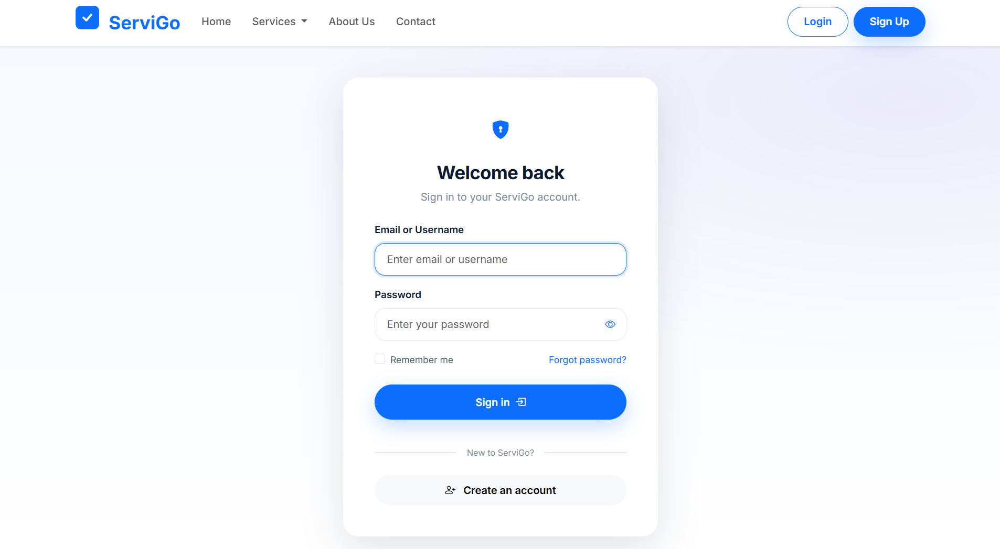
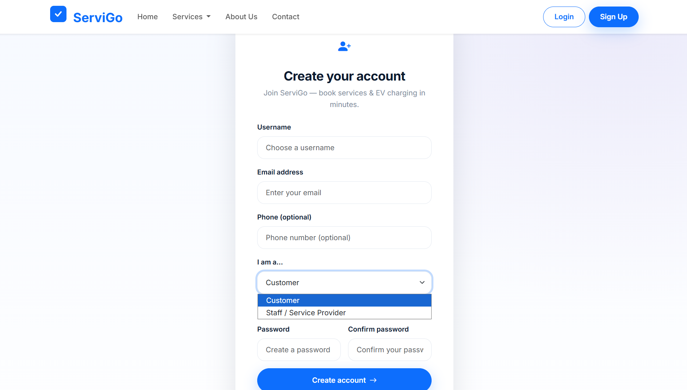
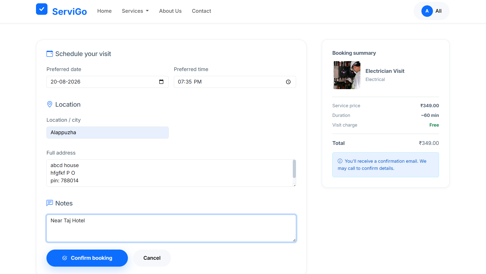
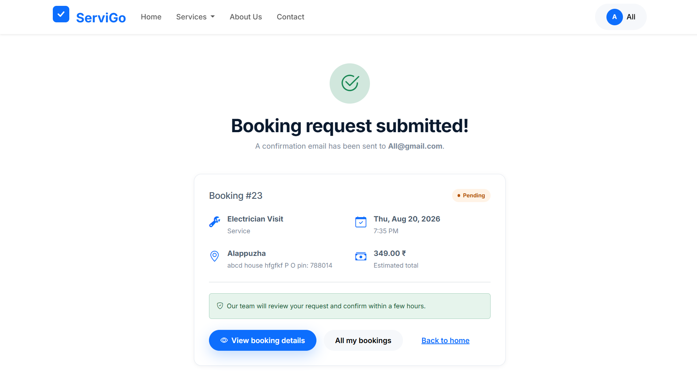
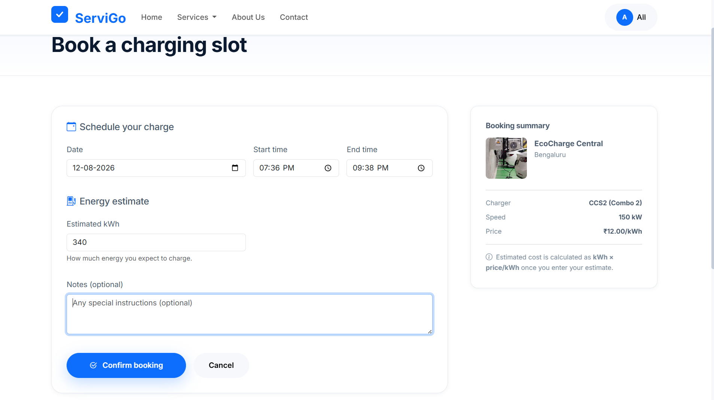
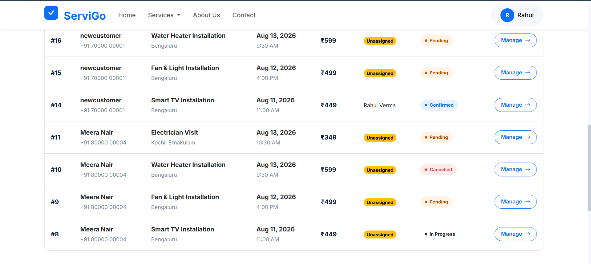
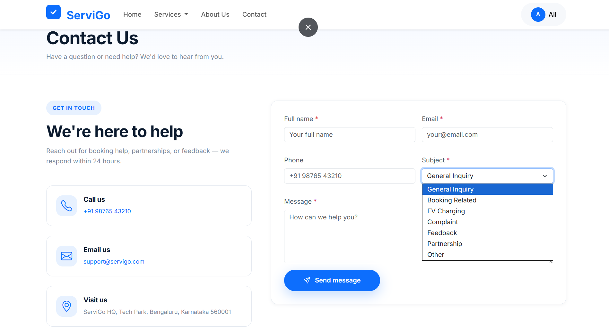

# 🏠 ServiGo

<div align="center">

### Home Services & EV Charging Platform

A full-featured home-services booking platform that connects customers with verified local professionals — electricians, plumbers, Smart TV experts and more — alongside a live network of EV charging stations with slot booking. Built on Django with role-based dashboards for customers, staff, and administrators.


</div>

<p align="center">
  
</p>

## 📖 Project Overview

**ServiGo** is a Django-based home-services marketplace that lets customers **book verified professionals** for home repairs and installations, and **reserve EV charging slots** at stations across their city — all from one account.

The platform covers the complete booking journey: customers **browse categories**, **pick a service**, **choose a date and time**, and **track their booking** through confirmation to completion. Staff get a **work queue with assignment controls** and a **daily schedule**, while administrators oversee the whole operation through a dedicated panel. Every status change is recorded in a **booking status history** timeline, keeping both sides informed at every step.

Built with **Django 5.2, Python 3.12, and Bootstrap 5**, ServiGo demonstrates production-grade practices: a custom email-based user model with three roles (customer / staff / admin), role-gated access control, secure registration, ORM-driven queries, and a responsive, polished interface.

---

## ✨ Key Features

| Area | Feature | What it does | Why it matters |
|------|---------|--------------|----------------|
| 🛠️ **Home Services** | Service catalogue | Browse electricians, plumbers, Smart TV experts and more by category, with search and filtering | Customers find the exact expert they need in seconds |
| 📅 **Booking System** | Schedule a visit | Pick a service, choose a preferred date/time and address, get instant booking confirmation | A transparent, no-call-required booking flow |
| 🔋 **EV Charging** | Station network | Find charging stations with connector types (CCS2, CHAdeMO, Type 2), speed, price per unit, and live availability | Drivers book a reliable charging slot before they arrive |
| ⚡ **EV Slot Booking** | Reserve a charge | Book a date and time window, estimate energy, see the expected cost upfront | No queues, no guesswork at the charger |
| 👤 **User Roles** | Customer / Staff / Admin | Role-based dashboards and permissions across the whole app | The right people see the right tools |
| 🔐 **Secure Auth** | Email-based accounts | Custom User model (email login), email-or-username backend, role-restricted public registration | No self-service admin accounts — deny by default |
| 📋 **Status Workflow** | Booking lifecycle | Pending → Confirmed → In Progress → Completed, with customer cancellation and staff assignment | Everyone always knows where a booking stands |
| 🕘 **Status History** | Audit timeline | Every status change is recorded with who changed it and why | Full accountability and a clean history trail |
| 🧑‍🔧 **Staff Queue** | Manage bookings | Staff see assigned and unassigned bookings, update statuses, and assign technicians | Day-to-day operations run smoothly |
| 📊 **Dashboards** | Per-role home | Customer dashboard with bookings, staff dashboard with today's schedule and stats | Each role lands on the screen they need |

---

## 📸 Screenshots

### Home & Discovery

<p align="center">
  
</p>
<p align="center"><em>Home page — hero search, category chips, featured services, and the EV charging network section.</em></p>

### Authentication

<p align="center">
  
  
</p>
<p align="center"><em>Login with email or username; registration lets users choose their role (customer / staff).</em></p>

### Service Booking Flow

<p align="center">
  
  
</p>
<p align="center"><em>Schedule a visit with a transparent price summary — then get instant confirmation.</em></p>

<p align="center">
  
</p>
<p align="center"><em>Booking detail with status badge, cancel option, and a full summary of the service.</em></p>

### EV Charging

<p align="center">
  
  
</p>
<p align="center"><em>Station details with connector types, speed and pricing — book a charging slot with an estimated cost.</em></p>

### Staff & Admin

<p align="center">
  
</p>
<p align="center"><em>Staff dashboard — overview stats, today's schedule, pending jobs, and recent activity.</em></p>

<p align="center">
  
  
</p>
<p align="center"><em>Staff bookings queue, and the management view with status updates and assignment.</em></p>

<p align="center">
  
</p>
<p align="center"><em>Django admin — booking status histories and full operational oversight.</em></p>

### Contact

<p align="center">
  
</p>
<p align="center"><em>Contact page with support channels and a categorized contact form.</em></p>

---

## 🛠️ Tech Stack

| Layer | Technology |
|-------|-----------|
| **Backend** | Django 5.2, Python 3.12 |
| **Frontend** | Bootstrap 5, Bootstrap Icons, Crispy Forms |
| **Database** | SQLite (dev) · PostgreSQL (production, via `DATABASE_URL`) |
| **Auth** | Custom `User` model (email as `USERNAME_FIELD`), email-or-username backend |
| **Media / Assets** | Pillow, Django static & media handling |
| **Tooling** | django-environ (env config), django-browser-reload (dev) |

---

## 🏗️ Project Structure

```
ServiGo/
├── accounts/          # Custom User, authentication, registration, profiles
├── services/          # Service categories & catalogue, image handling
├── bookings/          # Service bookings, status workflow & history
├── ev_charging/       # EV stations & charging slot bookings
├── dashboard/         # Role-based dashboards (customer / staff)
├── core/              # Home page, shared views & context
├── config/            # Django project settings (settings, urls, wsgi)
├── templates/         # Shared + per-app HTML templates
├── static/            # CSS, JS, images
├── media/             # User-uploaded media
├── tests/             # Test suite (per-app packages)
├── scripts/           # Dev helpers (run_dev.ps1, verify_auth.py)
├── manage.py
└── requirements.txt
```

---

## 🚀 Installation & Setup

**Prerequisites:** Python 3.12, Git.

```bash
# 1. Clone the repository
git clone https://github.com/Aby020/ServiGo.git
cd ServiGo

# 2. Create and activate a virtual environment
python -m venv venv
venv\Scripts\activate          # Windows
# source venv/bin/activate    # macOS / Linux

# 3. Install dependencies
pip install -r requirements.txt

# 4. Apply database migrations
python manage.py migrate

# 5. Create a superuser (admin)
python manage.py createsuperuser

# 6. (Optional) Seed demo data — categories, services, EV stations, demo users
python manage.py seed_demo

# 7. Run the development server
python manage.py runserver 127.0.0.1:8004
```

Open <http://127.0.0.1:8004> in your browser. On Windows you can use the shortcut launcher instead:

```powershell
.\scripts\run_dev.ps1          # starts on 127.0.0.1:8004
```

---

## ⚙️ Environment Variables

Create a `.env` file in the project root (or rely on sensible defaults):

| Variable | Description | Default |
|----------|-------------|---------|
| `SECRET_KEY` | Django secret key — set a strong value in production | generated dev key |
| `DEBUG` | Debug mode (`True`/`False`) | `True` |
| `ALLOWED_HOSTS` | Comma-separated allowed hosts | `localhost,127.0.0.1,testserver` |
| `DATABASE_URL` | Production database URL (e.g. PostgreSQL) | SQLite (dev) |
| `EMAIL_HOST` / `EMAIL_PORT` / etc. | SMTP settings for booking confirmation emails | console email (dev) |

---

## 🔒 Security

- **Custom User model** with email as the unique identifier — username login still supported via an email-or-username backend.
- **Role-restricted public registration** — only `customer` and `staff` can sign up through the public form; `admin` is created only via `seed_demo` or the Django admin, preventing self-service privilege escalation.
- **Role-based access control** — staff/admin views are gated by dedicated mixins; dashboards and booking data are filtered per user.
- **Open-redirect protection** — the login `next` parameter is validated with `url_has_allowed_host_and_scheme`.
- **Session-based auth** with Django's built-in password hashing.

---

## 🗺️ Roadmap

- [x] Authentication & registration with role selection
- [x] Service catalogue and category pages
- [x] Service booking flow with email confirmation
- [x] EV charging stations and slot booking
- [x] Customer, staff, and admin dashboards
- [x] Booking status workflow with audit history
- [ ] Online payment integration
- [ ] Customer reviews & ratings per service
- [ ] Real-time booking availability
- [ ] Mobile app (React Native / Flutter)

---

## 👤 Author

**Abi Thomas** — Full-Stack Developer

<a href="https://github.com/Aby020">
  
</a>
<a href="https://linkedin.com/in/abithomas-dev">
  
</a>

---

## 🤝 Support

For questions, feature requests, or bug reports, please open an [issue](https://github.com/Aby020/ServiGo/issues) on GitHub.

<div align="center">

**Made with ❤️ by Abi Thomas**

</div>
